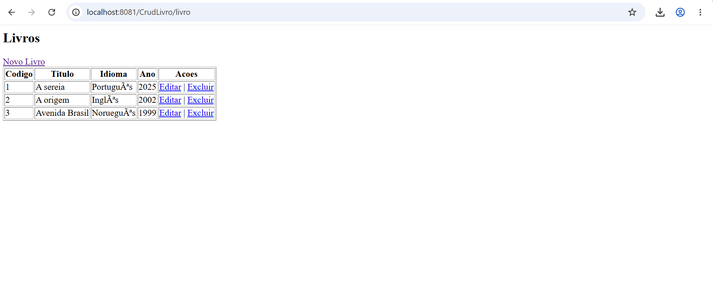

# CRUD Livro - Java Web (Servlets + JSP + SQL Server)

CRUD completo da entidade **Livro** utilizando Servlets, JSP e SQL Server, desenvolvido para a disciplina de Laboratório de Banco de Dados.

## 📋 Entidade

**Livro**
- `codigo` — INT (PK, auto incremento)
- `titulo` — VARCHAR(100)
- `idioma` — VARCHAR(50)
- `ano` — INT

## 🛠️ Tecnologias

- Java 11
- Servlets (javax.servlet)
- JSP + JSTL
- Apache Tomcat 9
- SQL Server
- Maven

## 🗄️ Estrutura do banco de dados

```sql
CREATE DATABASE db_livraria;
GO
USE db_livraria;
GO

CREATE TABLE Livro (
    codigo INT PRIMARY KEY IDENTITY(1,1),
    titulo VARCHAR(100) NOT NULL,
    idioma VARCHAR(50) NOT NULL,
    ano INT NOT NULL
);
GO
```

## ⚙️ Como rodar o projeto

1. Configure o banco de dados executando o script acima no SSMS
2. Crie um login SQL Server e dê permissão de acesso ao banco `db_livraria`
3. Ajuste usuário e senha em `src/main/java/conexao/ConexaoBD.java`
4. Compile o projeto:
mvn clean package

5. Copie o `.war` gerado (`target/CrudLivro.war`) para a pasta `webapps` do Tomcat
6. Inicie o Tomcat (`startup.bat`)
7. Acesse: `http://localhost:8080/CrudLivro/livro` (ajuste a porta se necessário)

## ✅ Funcionalidades

- Criar livro
- Listar livros
- Editar livro
- Excluir livro

## 📸 Demonstração

<p align="center">
  
</p>

<p align="center">
  
</p>
